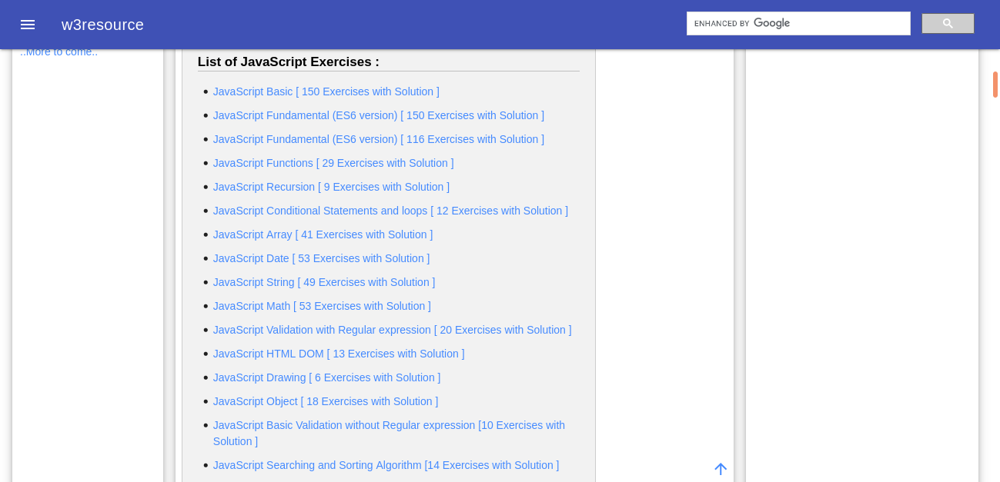

# JavaScript Exercice

This is the solutions of the JavaScript-Exercice from [www.w3resource.com](https://www.w3resource.com/), a website content web developmrent tutorial and exercice help you improve your coding skills.

## Table of contents

- [JavaScript Exercice](#javascript-exercice)
  - [Table of contents](#table-of-contents)
  - [Overview](#overview)
    - [The challenge](#the-challenge)
    - [Screenshot](#screenshot)
    - [Links](#links)
  - [My process](#my-process)
    - [Built with](#built-with)
    - [What I learned](#what-i-learned)
    - [Continued development](#continued-development)
  - [Author](#author)
  - [Acknowledgments](#acknowledgments)

## Overview

This exercice for the aim to practice what i learn on online courses about javascript.

### The challenge

Users should be able to:

- Find the solution for each exercice.
- Write his own code and algorithm.

### Screenshot

### Links

- Source URL: [https://www.w3resource.com/javascript-exercises/](https://www.w3resource.com/javascript-exercises/)

## My process

### Built with

- HTML
- JavaScript
- EcmaScript 6

### What I learned

Write code with javascript language, manipulate javascript string, array, object, regexp and DOM, create functions, method and prototype.

### Continued development
 
There is many other topic that does not cover yet, so i will continue my learn path in it.

## Author

- Facebook - [Tariq El bouhali](https://www.facebook.com/tariqelbouhali)

## Acknowledgments

I so grateful to w3resource for all tutorial and Exercice providing for us, it's really help me  to improve my knowledge in javascript language.
